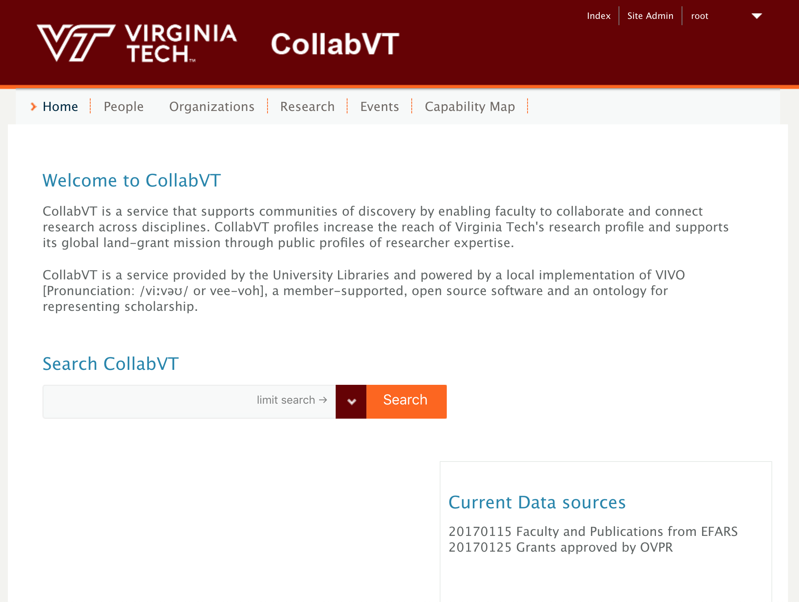

# Setup local VIVO instance with VTech theme.
* Step1: start up vagrant
```
$ git clone -b gui-developer-v1.9.3 https://github.com/vivo-community/vivo-vagrant vivo-vagrant   
$ cd vivo-vagrant
$ vagrant up
```
* Step2: Download VIVO_VT_Theme files and compress it
```
$ git clone git@github.com:VTUL/VIVO_VT_Theme.git
$ tar -zcvf VIVO_VT_Theme.tar.gz VIVO_VT_Theme
```
* Step3: Apply VTech theme files and lib files
```
$ vagrant ssh
$ sudo /etc/init.d/tomcat7 stop
$ cd /var/lib/tomcat7/webapps/vivo/themes/
$ rm -rf *
$ cd ..
$ tar -zxvf VIVO_VT_Theme.tar.gz
$ mv VIVO_VT_Theme/themes/* themes/.
$ chown -R vagrant:tomcat7 themes/* 
$ cp VIVO_VT_Theme/templates/freemarker/lib/lib-home-page.ftl templates/freemarker/lib/.
$ chown -R vagrant:tomcat7 templates/freemarker/lib/*
$ cp VIVO_VT_Theme/rdf/display/everytime/*.n3 /usr/local/vivo/vdata/rdf/display/everytime/.
$ chown -R vagrant:tomcat7 /usr/local/vivo/vdata/rdf/display/everytime/*.n3
$ sudo /etc/init.d/tomcat7 start
```
* Step4: Apply VTech theme
```
1. Login: http://localhost:8080/vivo/siteAdmin
2. Select "Site information" -> "Theme", select "vtech"
3. Click "Save changes"
4. Select "Site Maintenance" -> "Rebuild search index" -> "Rebuild"
```

* Step5: Configure RDF uploads folder
```
1. sudo -s
2. cd /usr/local/vivo/vdata/uploads/
3. mkdir rdf
4. chown -R vagrant:tomcat7 rdf/
5. cd /var/lib/tomcat7/conf
6. replace server.xml with [server.xml](tomcat/config/server.xml)
7. /etc/init.d/tomcat7 restart
```

You will see something like this below:

